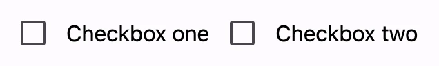

<!-- ---
name: Checkbox
dirname: checkbox
-----><!-- catalog-only-end -->


# Checkbox


*   [Design article](https://m3.material.io/components/checkbox) 
*   [API Documentation](#api)
*   [Source code](https://github.com/material-components/material-web/tree/main/checkbox)


<!--

## Interactive Demo



-->

<!-- catalog-only-end -->

## Usage

Checkboxes may be standalone, pre-checked, or indeterminate.


<!-- catalog-include "figures/checkbox/usage.html" -->

```html
<md-checkbox touch-target="wrapper"></md-checkbox>
<md-checkbox touch-target="wrapper" checked></md-checkbox>
<md-checkbox touch-target="wrapper" indeterminate></md-checkbox>
```

### Label

Associate a label with a checkbox using the `<label>` element.





<!-- catalog-include "figures/checkbox/usage-label.html" -->

```html
<label>
  <md-checkbox touch-target="wrapper"></md-checkbox>
  Checkbox one
</label>

<md-checkbox id="checkbox-two" touch-target="wrapper"></md-checkbox>
<label for="checkbox-two">Checkbox two</label>
```

## Accessibility

Add an
[`aria-label`](https://developer.mozilla.org/en-US/docs/Web/Accessibility/ARIA/Attributes/aria-label)
attribute to checkboxes without labels or checkboxes whose labels need to be
more descriptive.

```html
<md-checkbox aria-label="Select all checkboxes"></md-checkbox>

<label>
  <md-checkbox aria-label="Agree to terms and conditions"></md-checkbox>
  Agree
</label>
```

> Note: checkboxes are not automatically labelled by `<label>` elements and
> always need an `aria-label`. See b/294081528.

## Theming

Checkbox supports [Material theming](../theming/README.md) and can be customized
in terms of color and shape.

### Tokens

Token                                    | Default value
---------------------------------------- | -----------------------------------
`--md-checkbox-outline-color`            | `--md-sys-color-on-surface-variant`
`--md-checkbox-selected-container-color` | `--md-sys-color-primary`
`--md-checkbox-selected-icon-color`      | `--md-sys-color-on-primary`
`--md-checkbox-container-shape`          | `2px`

*   [All tokens](https://github.com/material-components/material-web/blob/main/tokens/_md-comp-checkbox.scss)


### Example


<!-- catalog-include "figures/checkbox/theming.html" -->

```html
<style>
  :root {
    /* System tokens */
    --md-sys-color-primary: #006a6a;
    --md-sys-color-on-primary: #ffffff;
    --md-sys-color-on-surface-variant: #3f4948;

    /* Component tokens */
    --md-checkbox-container-shape: 0px;
  }
</style>

<md-checkbox touch-target="wrapper"></md-checkbox>
<md-checkbox touch-target="wrapper" checked></md-checkbox>
```

<!-- auto-generated API docs start -->

## API


### MdCheckbox <code>&lt;md-checkbox&gt;</code>

#### Properties

<!-- mdformat off(autogenerated might break rendering in catalog) -->

| Property | Attribute | Type | Default | Description |
| --- | --- | --- | --- | --- |
| `checked` | `checked` | `boolean` | `false` | Whether or not the checkbox is selected. |
| `indeterminate` | `indeterminate` | `boolean` | `false` | Whether or not the checkbox is indeterminate.<br>https://developer.mozilla.org/en-US/docs/Web/HTML/Element/input/checkbox#indeterminate_state_checkboxes |
| `required` | `required` | `boolean` | `false` | When true, require the checkbox to be selected when participating in form submission.<br>https://developer.mozilla.org/en-US/docs/Web/HTML/Element/input/checkbox#validation |
| `value` | `value` | `string` | `'on'` | The value of the checkbox that is submitted with a form when selected.<br>https://developer.mozilla.org/en-US/docs/Web/HTML/Element/input/checkbox#value |
| `disabled` |  | `boolean` | `undefined` |  |
| `name` |  | `string` | `undefined` |  |

<!-- mdformat on(autogenerated might break rendering in catalog) -->

#### Methods

<!-- mdformat off(autogenerated might break rendering in catalog) -->

| Method | Parameters | Returns | Description |
| --- | --- | --- | --- |
| `formResetCallback` | _None_ | `void` |  |
| `formStateRestoreCallback` | `state` | `void` |  |

<!-- mdformat on(autogenerated might break rendering in catalog) -->

#### Events

<!-- mdformat off(autogenerated might break rendering in catalog) -->

| Event | Type | [Bubbles](https://developer.mozilla.org/en-US/docs/Web/API/Event/bubbles) | [Composed](https://developer.mozilla.org/en-US/docs/Web/API/Event/composed) | Description |
| --- | --- | --- | --- | --- |
| `change` | `Event` | Yes | No | The native `change` event on [`<input>`](https://developer.mozilla.org/en-US/docs/Web/API/HTMLElement/change_event) |
| `input` | `InputEvent` | Yes | Yes | The native `input` event on [`<input>`](https://developer.mozilla.org/en-US/docs/Web/API/HTMLElement/input_event) |

<!-- mdformat on(autogenerated might break rendering in catalog) -->

<!-- auto-generated API docs end -->
