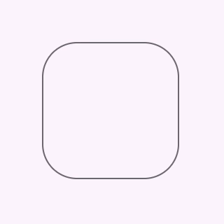

<!-- ---
name: Ripple
dirname: ripple
ssrOnly: true
-----><!-- catalog-only-end -->


# Ripple


<!-- go/md-ripple -->


[Material Web catalog](https://material-web.dev/components/ripple/)**


Ripples are
[state layers](https://m3.material.io/foundations/interaction/states/state-layers)
used to communicate the status of a component or interactive element.

A state layer is a semi-transparent covering on an element that indicates its
state. A layer can be applied to an entire element or in a circular shape.


*   [Design article](https://m3.material.io/foundations/interaction/states/state-layers)

*   [API Documentation](#api)
*   [Source code](https://github.com/material-components/material-web/tree/main/ripple)


<!--

## Interactive Demo



-->

<!-- catalog-only-end -->

## Usage

Ripples display on hover and press pointer interactions. They may be attached to
a control in one of three ways.





<!-- Need to add catalog-include "figures/<component>/usage.html" -->

1.  Attached to the parent element

    ```html
    <style>
      .container {
        position: relative;
      }
    </style>
    <button class="container">
      <md-ripple></md-ripple>
    </button>
    ```

1.  Attached to a referenced element

    ```html
    <style>
      .container {
        position: relative;
      }
    </style>
    <div class="container">
      <md-ripple for="control"></md-ripple>
      <input id="control">
    </div>
    ```

1.  Attached imperatively

    ```html
    <style>
      .container {
        position: relative;
      }
    </style>
    <div class="container">
      <md-ripple id="ripple"></md-ripple>
      <button id="ripple-control"></button>
    </div>
    <script>
      const ripple = document.querySelector('#ripple');
      const control = document.querySelector('#ripple-control');
      ripple.attach(control);
    </script>
    ```

> Note: ripples must be placed within a `position: relative` container.

### Unbounded

To create an unbounded circular ripple centered on an element, use the following styles.

```css
.container {
  display: flex;
  place-content: center;
  place-items: center;
  position: relative;
}

md-ripple.unbounded {
  border-radius: 50%;
  inset: unset;
  height: var(--state-layer-size);
  width: var(--state-layer-size);
}
```


<!-- Need to add catalog-include "figures/<component>/usage.html" -->

```html
<style>
  .container {
    border-radius: 50%;
    height: 32px;
    width: 32px;

    /* Needed for unbounded ripple */
    display: flex;
    place-content: center;
    place-items: center;
    position: relative;
  }

  md-ripple.unbounded {
    /* Needed for unbounded ripple */
    border-radius: 50%;
    inset: unset;
    height: 64px;
    width: 64px;
  }
</style>
<button class="container">
  <md-ripple class="unbounded"></md-ripple>
</button>
```

## Accessibility

Ripples are visual components and do not have assistive technology requirements.

## Theming

Ripples support [Material theming](../theming/README.md) and can be customized
in terms of color.

### Tokens

Token                    | Default value
------------------------ | ------------------------
`--md-ripple-hover-color` | `--md-sys-color-on-surface`
`--md-ripple-pressed-color` | `--md-sys-color-on-surface`

*   [All tokens](https://github.com/material-components/material-web/blob/main/tokens/_md-comp-ripple.scss)


### Example


<!-- Need to add catalog-include "figures/<component>/usage.html" -->

```html
<style>
:root {
  --md-sys-color-primary: #006A6A;
  --md-ripple-hover-color: var(--md-sys-color-primary);
  --md-ripple-pressed-color: var(--md-sys-color-primary);
}

.container {
  position: relative;
}
</style>
<button class="container">
  <md-ripple></md-ripple>
</button>
```

<!-- auto-generated API docs start -->

## API


### MdRipple <code>&lt;md-ripple&gt;</code>

#### Properties

<!-- mdformat off(autogenerated might break rendering in catalog) -->

| Property | Attribute | Type | Default | Description |
| --- | --- | --- | --- | --- |
| `disabled` | `disabled` | `boolean` | `false` | Disables the ripple. |
| `htmlFor` |  | `string` | `undefined` |  |
| `control` |  | `HTMLElement` | `undefined` |  |

<!-- mdformat on(autogenerated might break rendering in catalog) -->

#### Methods

<!-- mdformat off(autogenerated might break rendering in catalog) -->

| Method | Parameters | Returns | Description |
| --- | --- | --- | --- |
| `attach` | `control` | `void` |  |
| `detach` | _None_ | `void` |  |

<!-- mdformat on(autogenerated might break rendering in catalog) -->

<!-- auto-generated API docs end -->
